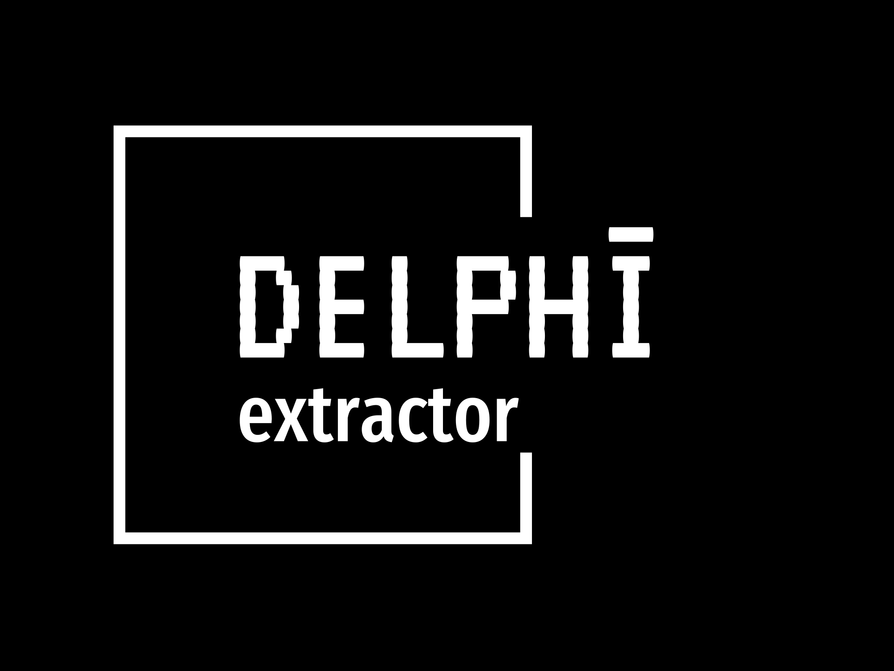

# Delphī



A Python extractor program for video files to raw text

---
## Core Software Components in `src`

### Page Extractor
- Utilize motion detection to recognize a full page, scanning its contents
  -- Extract the still frame
- Increment and count prefixes and page numbers

### Text Extractor
- Feed in the raw pages as image files and generate text pages
  -- Utilize Tesseract OCR

### Page Flattener
- Detect edges and contours for accurate page detection

### Quality Rating
- Input a frame and provide a quality score
  -- Essential for ensuring high quality text extraction

---
## Setting Up

### Virtual Enviornment
- Start your Conda environment before downloading any modules with Pip <br>
  - `conda create --name delphi`
  - `conda activate delphi`
  - Turn it off: `conda deactivate`
- For `venv` from Python Standard Library
  - Create a new Venv: `python -m venv delphi`
  - Windows: `.\delphi\Scripts\activate`
  - Mac/Linux: `source delphi/bin/activate`
  - Turn it off: `deactivate`

### Installation
- Then use Pip to install dependencies <br>
`pip install -r requirements.txt`

---
## Running
- Before extracting pages from a video, add your video file in `videos` directory.
- Match the name of the Video Path in `main.py`:
```python
    # Video Path
    video_path = 'videos/test-scan.mov'
```
- Alternatively, set a custom Video Path for your liking
- Start program with: ```python main.py```

### Main.py
- Entry point to run program: `python main.py`
- Images will be extracted into a `output_frames` folder
- Text file will be saved as ..... WIP

### Testing
- To test text extraction from a still frame: `python testing/test_main.py`

### Docker
- First, check services running and start your Docker Daemon: If using Homebrew:
```
brew services list
brew services start docker
brew services stop docker
```
If using MacOS Terminal:
```
launchctl start com.docker.dockerd
launchctl stop com.docker.dockerd
```
- For Keras and DocTR OCR programs, Docker is a preferred option
- Build a specific Docker image:
`docker build -t ocr_testing .`
- Run the image and create a container:
`docker run -it ocr_testing`
- Replace `ocr_testing` with another name for the tests if needed.
- Or just execute the Docker script and follow the prompts to build and run:
`sh run_docker.sh`
- Inside of the `/docker` directory, `docker_entrypoint.sh` defines which tests to run, modify the test scripts if needed.

---
# TODO
- User Selection Option before extraction:
  - A) Use book holder and tripod, and/or visual audio cues (probably generates better results)
  - B) Use regular video of user flipping pages (less work on user's end but more error prone)

- MVP
  - Do Image to text extraction first 
  - Then focus on motion detection and helper algorithms for Video to Images of Pages

- Modify Main.py for correct user flows
  - Video to frame extraction
  - Frame to text extraction

- Image extraction ...
